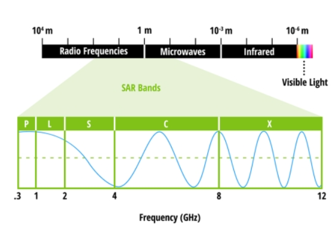
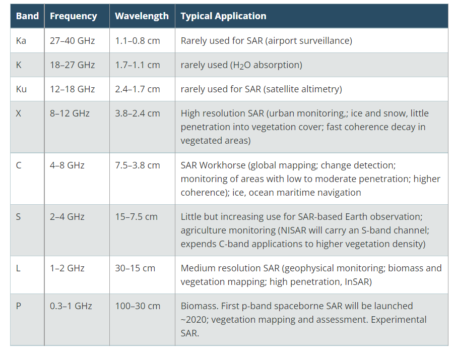

```{r xaringan-themer, include=FALSE, warning=FALSE}
library(xaringanthemer)
style_mono_light(
  base_color = "#23395b",
  header_font_google = google_font("Josefin Sans"),
  text_font_google   = google_font("Montserrat", "400", "300i"),
  code_font_google   = google_font("Fira Mono")
)
```
## Sensor summary

### What is the Synthetic Aperture Radar (SAR)

SAR is a type of active data collection where a sensor produces its own energy and then records the amount of that energy reflected back after interacting with the Earth.

**What is Synthetic**
.pull-left[
  This technique has a lot to do with spatial resolution. For a given wavelength, the longer the antenna, the higher the spatial resolution. But too large an antenna length is not practical. Therefore to ensure a clear resolution, the acquired data from several shorter antennas are combined into one larger antenna.
]
```{r echo=FALSE, out.width='45%', fig.align='right', fig.cap= "Synthetic. Source: (https://www.earthdata.nasa.gov/learn/backgrounders/what-is-sar)"}

```

---
### Advantanges

 + **All-weather**  
 
 Self-illuminated light source for night work
 
 + **All-time**  
 
 Electromagnetic waves can penetrate the water vapour clouds almost without distortion
 
 + **High-resolution** 
 
 Short antennas are simulated into larger antennas after a series of acquisitions and provides
 high-resolution data
 
### Disadvantages

 + **Tedious pre-processing steps which lower level SAR data requires**
---

High penetration is an important feature of SAR, where **wavelength** and **scattering** are important factors to consider

### Frequency and Wavelength

.pull-left[
Radar sensors utilize longer wavelengths at the centimeter to meter scale, which gives it special properties, such as the ability to see through clouds]

```{r echo=FALSE, out.width='50%', fig.align='right', fig.cap= "Frequency and Wavelength. Source: (https://www.earthdata.nasa.gov/learn/backgrounders/what-is-sar)"}

```
---
### Polarization and Scattering

Radar identifies surface structures based on polarization (the direction of the plane of oscillation of electromagnetic waves: horizontal(H) and vertical(V) polarization) and the type of scattering(rough surface scattering,volume scattering and double bounce).


+ Scattering caused by bare soil or water is rough surface scattering and is most sensitive to VV scattering.
+ Volume scattering, for example, caused by the leaves and branches in a forest canopy, is most sensitive to cross-polarized data like VH or HV scattering.
+ Double bounce, is caused by buildings, tree trunks, or inundated vegetation and is most sensitive to an HH polarized signal.


```{r echo=FALSE, out.width='60%', fig.align='center', fig.cap= " Source: (https://www.earthdata.nasa.gov/learn/backgrounders/what-is-sar)"}
knitr::include_graphics('scattering.png')
```
---

### Different working modes of SAR

|  Types                | Description|                                         
|:----------------      |:-------------------------------                     |
| Stripmap SAR          | Antenna pointing remains the same, imaging of a strip on the ground               | 
| Scan SAR         | Multiple scans of the antenna along the direction to obtain a wide mapping bandwidth                                | 
| InSAR         | The radar makes at least two observations of the target to obtain a plural image to extract the height and displacement of the terrain| 

---

### Steps for data pre-processing

 + Apply Orbit File
 Defines the relationship between ground and image coordinates, improves accuracy of later orbit-based calibration steps.
 
 + Radiometric Calibration
 Converts the image pixel values from digital number to a standard geophysical measurement unit of radar back scatter.
 
 + De-Bursting
 SAR scenes can be made up of multiple swaths or sections. This step combines all swaths into a single image.
 
 + Terrain Correction: Radiometric Terrain Flattening (RTF) & Geocoding
 RTF: Uses a DEM to remove geometry-dependent radiometric distortions; normalizes measured backscatter with respect to terrain slope.
 + Geocoding: Uses a DEM to remove geometric distortions such as foreshortening, layover, and shadow; connects the image to a geographic coordinate system.
---

### Case study—Application to the Ruinon landslide in the Italian Alps

 **Application areas：Natural disaster monitoring**
 
 **Data processing methods**
  + The SAR images are obtained from the raw data collected by the LISA system
  + Data calibration - eliminating errors introduced by the system
  + Focus - Geographical alignment of merged radar images
  + Groups of three or four images were coherently averageD — Minimize artifacts due to moving objects on the observed scene
  + Analysis coherence in the areas where the phase measurement is disturbed - Improving accuracy
  + Analysis of sequences of interferograms, and analysis of the area of displacement and the time of displacement
  
**Limitations and future perspectives**

The short sequences of interferograms do not allow for a clear understanding of landslide mechanisms in space and time. If the long time series were perfected, they could be used directly for forecasting and early warning purposes to predict the time of slope breakage.

---

## Reflection

By studying the information on SAR, I found that it has a wide range of applications, such as disaster monitoring, navigation, agricultural monitoring, military, etc. Data calibration is a necessary step, depending on the complexity of the data and the level of the data. I have learnt the importance of geocalibration of data and will continue to apply this to my remote sensing studies and work.

---

# References


Earth Science Data Systems N., 2020. What is Synthetic Aperture Radar? . Earthdata. URL https://www.earthdata.nasa.gov/learn/backgrounders/what-is-sar (accessed 2.15.23).

Overview | Get to Know SAR [WWW Document], n.d. . NASA-ISRO SAR Mission (NISAR). URL https://nisar.jpl.nasa.gov/mission/get-to-know-sar/overview (accessed 2.15.23).

Tarchi, D., Casagli, N., Moretti, S., Leva, D., Sieber, A.J., 2003. Monitoring landslide displacements by using ground-based synthetic aperture radar interferometry: Application to the Ruinon landslide in the Italian Alps. Journal of Geophysical Research: Solid Earth 108. https://doi.org/10.1029/2002JB002204


  
  
 
 
 
 
 
 
 
 
 